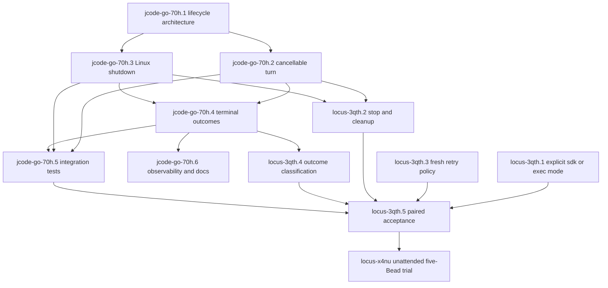

# Linux Jcode Go SDK and Locus stability plan

Status: approved for orchestration and implementation

Architecture owners:

- `jcode-go` owns private runtime launch, request correlation, turn lifecycle, typed terminal outcomes, cancellation, transport failure, and Linux process cleanup.
- Locus owns worktree selection, stage policy, retries, gates, canonical validation, integration, provider mutation, receipts, run cancellation, and cleanup orchestration.
- The Jcode agent always runs in the explicit task worktree supplied by the orchestrator. SDK workers are started from that project directory, not from the Locus repository.
- Swarm is not used for `jcode-go` implementation unless the coordinator can bind the worker to the exact `jcode-go` worktree and approved OpenAI OAuth route.
- Linux is the only supported supervision target in this program. Windows parity is out of scope.

## Evidence and problem statement

A real Locus run, `run-6160013cfdb5`, authenticated through OpenAI OAuth, selected `gpt-5.6-luna`, completed many HTTPS turns, implemented `locus-3taw`, produced commit `2fca6e40`, and passed focused tests, build, lint, and changelog validation. It also exposed a non-hermetic inherited `JCODE_HOME` test, which was fixed.

The final retry later spent more than six minutes before establishing a provider connection. `locus stop` did not interrupt the active SDK turn, so the controller had to be terminated. The run therefore did not demonstrate the complete integration, provider completion, push, and cleanup lifecycle.

The direct process-backed Jcode adapter still exists in Locus. Current staged Jcode composition selects the native Go SDK bridge unconditionally, so the direct path is not selectable as a normal fallback. This plan restores it as an explicit sealed mode. It never introduces silent fallback.

## Architectural invariants

1. The caller chooses an explicit Linux working directory. Every private Jcode agent and every implementation command executes in that directory.
2. One SDK component owns each lifecycle responsibility:
   - `Client`: protocol connection, request correlation, subscriptions, and transport failure.
   - session or turn API: prompt acceptance, event stream, server cancellation, and terminal outcome.
   - `Instance`: bridge, daemon, process group, socket, runtime directory, and SDK-owned home cleanup.
   - Locus: workflow policy and durable effect accounting.
3. Local context cancellation and server-side turn cancellation remain distinguishable.
4. Every turn produces exactly one immutable typed terminal outcome.
5. Private runtime shutdown is bounded. Linux cleanup uses process groups, SIGTERM, a finite grace interval, SIGKILL escalation, bounded reap, and owned-path removal.
6. Locus never parses SDK error strings or constructs raw protocol cancellation after the typed SDK contract lands.
7. Jcode execution mode is explicit, previewed, sealed, and recorded as `sdk` or `exec`. No mode, provider, or model fallback is automatic.
8. Acceptance requires the public path. Unit fixtures cannot replace a real private SDK prompt and a complete Locus lifecycle.

## Bead portfolio

### jcode-go epic

Epic: `jcode-go-70h` — Stabilize the jcode-go private runtime lifecycle

| Bead | Priority | Responsibility | Hard prerequisites |
|---|---:|---|---|
| `jcode-go-70h.1` | P1 | Define the Linux SDK lifecycle ownership contract in `docs/architecture.md` | None |
| `jcode-go-70h.2` | P0 | Add an owned cancellable turn lifecycle API | `jcode-go-70h.1` |
| `jcode-go-70h.3` | P0 | Make Linux private-instance shutdown bounded and orphan-free | `jcode-go-70h.1` |
| `jcode-go-70h.4` | P0 | Unify typed terminal outcomes for turn and transport failures | `jcode-go-70h.2`, `jcode-go-70h.3` |
| `jcode-go-70h.5` | P1 | Add Linux private-runtime lifecycle acceptance tests | `jcode-go-70h.2`, `.3`, `.4` |
| `jcode-go-70h.6` | P2 | Complete redacted lifecycle observability and examples | `jcode-go-70h.4` |

### Locus epic

Epic: `locus-3qth` — Stabilize Locus native Jcode SDK execution

| Bead | Priority | Responsibility | Hard prerequisites |
|---|---:|---|---|
| `locus-3qth.1` | P0 | Seal an explicit Jcode SDK or direct-exec execution mode | None |
| `locus-3qth.2` | P0 | Make `locus stop` interrupt and clean up native SDK stages | External: `jcode-go-70h.2`, `.3` |
| `locus-3qth.3` | P1 | Start a fresh SDK session after an unhealthy retry boundary | None |
| `locus-3qth.4` | P1 | Classify typed jcode-go outcomes into Locus handlers | External: `jcode-go-70h.4` |
| `locus-3qth.5` | P1 | Complete paired SDK and direct-exec lifecycle acceptance | `locus-3qth.1`, `.2`, `.3`, `.4` |

`locus-3qth.5` blocks the existing unattended five-Bead trial `locus-x4nu`. The epic is coordinated with existing Beads `locus-bzrr`, `locus-7v54`, `locus-hxzt`, `locus-drae`, `locus-3taw`, and `locus-qk3o` rather than duplicating their scopes.

## Execution DAG

## Orchestration waves

At most three workers may run concurrently. Parallel work is allowed only when responsibility and likely write surfaces are disjoint. Merge and combined validation remain serialized.

### Wave 0: planning and repository setup

One Sol High agent, running through native OpenAI OAuth in a dedicated `jcode-go` worktree:

- Execute `jcode-go-70h.1`.
- Produce `docs/architecture.md`.
- Confirm the public compatibility strategy before core code starts.
- Do not use swarm unless its worker `working_dir` is the exact `jcode-go` worktree.

In parallel, the root coordinator may prepare worktrees and verify Bead reservations but makes no competing architecture decision.

### Wave 1: independent foundations

Run up to three lanes:

1. **SDK turn lane, Sol High:** `jcode-go-70h.2` in its own `jcode-go` worktree.
2. **Linux supervision lane, Sol High:** `jcode-go-70h.3` in a separate `jcode-go` worktree. It owns `launch.go`, `process_unix.go`, and focused supervision tests.
3. **Locus execution-mode lane, Sol High:** `locus-3qth.1` in a dedicated Locus worktree, using direct `jcode` execution rather than the unstable SDK path.

The two SDK lanes may run in parallel only after `jcode-go-70h.1` fixes their shared API boundaries. The root serially integrates both and runs the combined jcode-go suite before Wave 2.

### Wave 2: consumers and retry policy

Run up to three lanes:

1. **SDK terminal lane, Sol High:** `jcode-go-70h.4` after both core SDK foundations land.
2. **Locus retry lane, Sol High or Medium:** `locus-3qth.3`, independent of the new SDK API.
3. **SDK test harness preparation, Sol Medium:** begin non-conflicting fixture and test-harness work for `jcode-go-70h.5`, but do not finalize acceptance assertions until `.4` lands.

### Wave 3: Locus SDK integration

Run up to two lanes after the required jcode-go contracts are merged and pinned by Locus:

1. **Cancellation lane, Sol High:** `locus-3qth.2` consumes `.2` and `.3`.
2. **Classification lane, Sol High:** `locus-3qth.4` consumes `.4`.

These lanes may proceed in parallel if source inspection confirms they do not both rewrite the same bridge lifecycle function. Otherwise run them serially.

### Wave 4: verification and documentation

Run up to two lanes:

1. **SDK acceptance, Sol Medium:** finish `jcode-go-70h.5`, including deterministic stalls, cwd proof, cancellation, forced process cleanup, and optional real OAuth smoke.
2. **SDK documentation, Sol Medium:** `jcode-go-70h.6` after typed outcomes stabilize.

Run normal tests first, then race-enabled lifecycle tests. Do not run multiple broad Go suites concurrently.

### Wave 5: real paired Locus acceptance

Execute `locus-3qth.5` serially:

1. Build a fresh private Locus binary.
2. Run the same disposable code-change Bead through explicit `exec` mode.
3. Run it again from the same base through explicit `sdk` mode.
4. Use native OpenAI OAuth, `gpt-5.6-luna`, and `xhigh` for both arms.
5. Observe worktree cwd, worker result, canonical checks, integration, provider completion, push, cleanup, and terminal status.
6. Exercise `locus stop` against a deliberately blocked SDK run and prove bounded cleanup.
7. Unblock `locus-x4nu` only after both arms pass.

## Agent launch contract

Implementation workers are durable direct Jcode processes, not root-repository swarm children.

For each lane:

1. Create or reuse the Bead's dedicated Git worktree.
2. Launch Jcode with the working directory explicitly set to that worktree using `-C <worktree>` or from that directory.
3. Select `--provider openai` and `--model gpt-5.6-sol` explicitly.
4. Use Sol High for architecture, public lifecycle APIs, cancellation, process supervision, and Locus sealed-contract changes.
5. Use Sol Medium for bounded tests, documentation, examples, and straightforward consumers.
6. Persist PID, log, and exit status under `$JCODE_SCRATCH_DIR`.
7. The worker owns only its Bead and worktree. The root coordinator owns dependency ordering, cross-repository version pins, integration, provider updates, and user communication.
8. Swarm is permitted only if its configured route is approved and `working_dir` is exactly the target project worktree. Otherwise use direct Jcode launch.

## Validation contract

### jcode-go

- Focused unit and race tests for request, turn, terminal, and process supervision contracts.
- `go test ./... -count=1` after each integrated wave.
- Linux integration tests for process groups, TERM grace, KILL escalation, bounded reap, cwd, sockets, runtime directories, and ephemeral homes.
- One real public SDK prompt through a private OpenAI OAuth runtime.
- One real or representative stalled turn cancelled through the public SDK API.

### Locus

- Focused package tests for config, sealing, adapter, runner cancellation, retry mapping, and terminal classification.
- `make test`, `make lint`, changelog validation, and private-agent build after integrated waves.
- Built-binary CLI smoke for both explicit execution modes.
- Durable disposable E2E for stop, recovery, integration, provider completion, push, and cleanup.
- Revalidate after merging the latest `origin/dev` into each worktree and again after landing on `dev`.

## Completion criteria

The program is complete only when:

1. `jcode-go` has a documented and tested Linux lifecycle contract.
2. A private SDK agent runs in the caller-selected worktree and completes a real OAuth prompt.
3. A stalled turn can be cancelled and all owned Linux resources are removed within a finite bound.
4. Locus offers explicit sealed `sdk` and `exec` modes with no silent fallback.
5. `locus stop` interrupts an SDK stage and records a truthful terminal lifecycle.
6. The paired acceptance Bead succeeds completely in both modes.
7. The five-Bead unattended Locus trial is unblocked.
